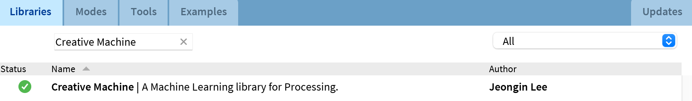

# Creative Machine

A Machine Learning library for [Processing](https://processing.org/). Visit [Creative Machine website](https://jjeongin.github.io/creative-machine) for more information about the library.

## Install
Install using the contribution manager in Processing application. 

- Go to ```Sketch > Import Library > Manage Libraries...``` and search  Creative Machine.



## API Reference
Visit our [documentation website](https://jjeongin.github.io/creative-machine/reference/tutorial) 🤖

## Build
- First, install [Adoptium OpenJDK 17](https://adoptium.net/) (required by Processing 4+)

Run gradle to build a new release package under `/release/creative_machine.zip`:

```bash
# windows
gradlew.bat releaseProcessingLib

# mac / unix
./gradlew releaseProcessingLib
```

## Developing in IntelliJ IDEA

The library can be imported as an IntelliJ project following the steps below:

- Download and install [IntelliJ IDEA](https://www.jetbrains.com/idea/download/)
- Clone this repo and build the library following the instructions in the previous section
- Clone the [processing4 repo](https://github.com/processing/processing4)
- Create new project in IntelliJ with the name and location of your choice, for example ```ml-dev```
- Create new module in the project for core Processing, using as content root and the module file location the ```core``` folder under the processing4 repo. As "JARs or Directory" dependency, add ```<path to processing4 repo>/core/library```
- Create another module in the project, this time for Creative Machine. Use the Creative Machine's root folder as the content root and module file location. Add the processing-core module as module dependency for this module, and the ```libs``` subdirecotry inside the Creative Machine directory (it should have been created during library building step) as itss "JARs or Directory" dependency
- Add the proccessing-core and Creative Machine modules as dependencies in the main module of the project (```ml-dev```)
- You can now create a test program in under the main module of the project, for example the following code will apply a pre-generated object detection model on an input image:

```
import processing.core.*;
import ml.*;

public class DetectTest extends PApplet {
    ObjectDetector detector;
    PImage img;

    public void settings() {
        size(parseInt(args[0]), parseInt(args[1]));
    }

    public void setup() {
        detector = new ObjectDetector(this, "coco_ssd");
        img = loadImage("dog_bike_car.jpeg");
        MLObject[] output = detector.detect(img, "output.png");
        // print a label and confidence score of each object
        for (int i = 0; i < output.length; i++) {
            println(output[i].getLabel() + " detected! (confidence: " + output[i].getConfidence() + ")");
        }
    }

    public void draw() {
       // draw a bounding box of each object
       image(img, 0, 0);
       noFill();
       stroke(255, 0, 0);
       for (int i = 0; i < output.length; i++) {
           MLObject obj = output[i];
           rect(obj.getX(), obj.getY(), obj.getWidth(), obj.getHeight());
       }
    }

    static public void main(String[] args) {
      PApplet.main(DetectTest.class, "768", "576");
    }
}
```

Please note that the input image should be placed inside the subdirectory ```data``` located inside the root of the IntelliJ project (i.e.: ```ml-dev/data```)