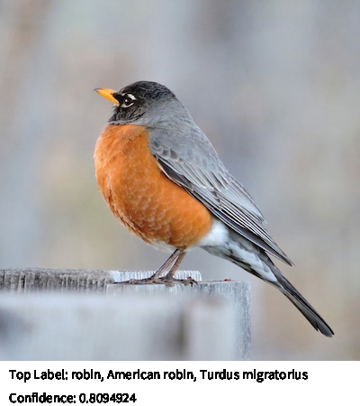

# Image Classifier
Classify image



## Quick Start
```
// create an Image Classifier
ImageClassifier classifier = new ImageClassifier(this, "MobileNet");

// load input image
PImage img = loadImage("data/bird.jpeg");

// run image classification
MLObject[] output = classifier.classify(img);
```

## Usage
### Initialize
```
ImageClassifier classifier = new ImageClassifier(this, modelNameorURL);
```
#### Parameters
String modelNameOrURL: (required) Can be a model name of built-in models ("MobileNet" or "Darknet") or a remote url/file path to a parent directory containing TensorFlow saved_model folder
### Methods
classify(PImage image): Runs image classification on [PImage](https://processing.org/reference/PImage.html) and returns an array of [MLObject]() with image label and confidence score.
```
PImage img = loadImage("data/bird.jpeg");

// classify image
MLObject[] output = classifier.classify(img);

// print the label with the highest confidence (by default, output contains top 5 labels with the highest confidence scores)
println("Label: " + output[0].getLabel() + ", Confidence: " + output[0].getConfidence());
```
***Input***
- PImage image: (required) Image with an object to be classified.

***Output***
- MLObject[]: List of [MLObject](). Contains top K (default K = 5) labels and confidence scores.

## Examples
[ImageClassifierExample](https://github.com/jjeongin/ml4processing/tree/master/examples/ImageClassifierExample)
