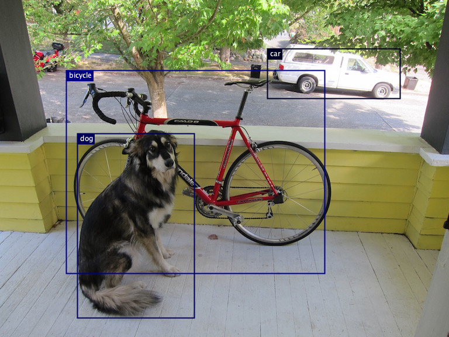

# Object Detector
Object Detection model 



## Quick Start
```
// create an Object Detector
ObjectDetector detector = new ObjectDetector(this, "cocossd");

// load input image
PImage img = loadImage("data/dog_bike_car.jpeg");

// run object detection
MLObject[] output = detector.detect(img);
```

## Usage
### Initialize
```
ObjectDetector detector = new ObjectDetector(this, modelNameorURL);
```
#### Parameters
String modelNameOrURL: (required) Can be a model name of built-in models ("openimages_ssd", "cocossd", or "yolo") or a remote url/file path to a parent directory containing TensorFlow saved_model folder
### Methods
detect(PImage image, Boolean saveBoundingBoxImage, String fileName): Runs object detection on [PImage](https://processing.org/reference/PImage.html) and a save bounding box image with the specified file name. Returns an array of [MLObject]().
```
PImage img = loadImage("data/dog_bike_car.jpeg"); // input image

// run object detection only
MLObject[] output = detector.detect(img);

// run object detection and save bounding box image
MLObject[] output = detector.detect(img, true, "data/dog_bike_car_output.png");
```
***Input***
- PImage image: (required) Image to run object detection on.
- Boolean saveBoundingBoxImage: (optional) true or false
- String fileName: (optional) File name to store the output image. Should be **.png** files only. Saved under the Processing sketch directory by default, specify the subdirectory name to save under an existing directory within the sketch directory. If null, the image is saved as "output.png" under the sketch directory.

***Output***
- MLObject[]: List of [MLObject](). 

## Examples
[ObjectDetectorExample](https://github.com/jjeongin/ml4processing/tree/master/examples/ObjectDetectorExample)

[ObjectDetectorFromURLExample](https://github.com/jjeongin/ml4processing/tree/master/examples/ObjectDetectorfromURLExample)
